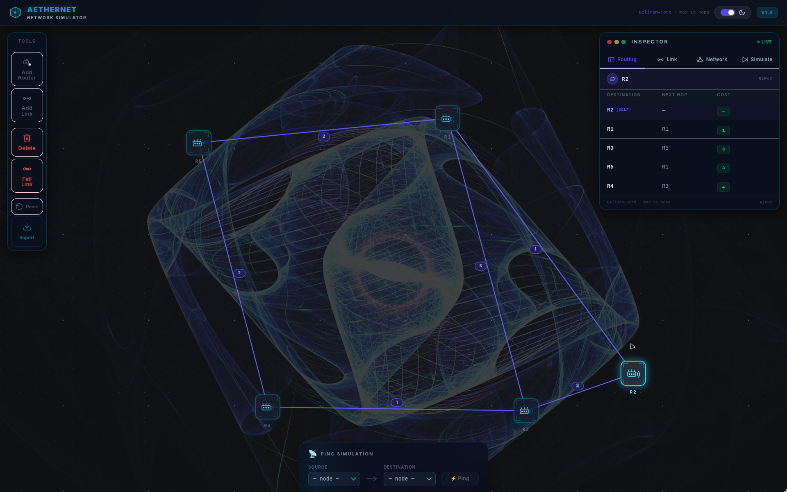
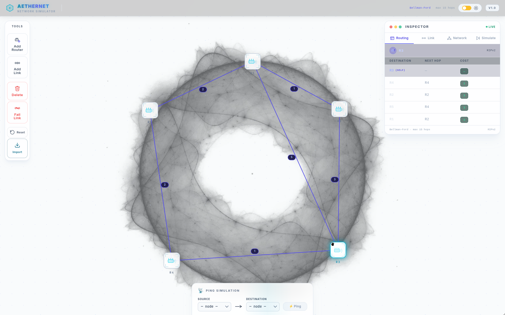

# AetherNet - RIPv2 Network Simulator

<p align="center">
  
  
</p>

## Project Overview

AetherNet is a highly visual, interactive network simulator built specifically to demonstrate the mechanics of the Routing Information Protocol version 2 (RIPv2). Designed with a sci-fi, cinematic aesthetic, AetherNet visualizes how routing tables compute and converge in real-time across a localized network layout. 

With full support for topological alterations out-of-the-box, users can trigger dynamic link failures, trace animated packet traversals hop-by-hop, and see firsthand how routing disruptions eventually settle into optimal pathways.

## Technical Implementation

### Core Routing Engine
The simulation runs on a pure JavaScript implementation of the **Bellman-Ford Distance-Vector** algorithm. 
- The engine calculates optimal paths while gracefully modeling RIPv2 constraints. 
- It actively mitigates the classic **count-to-infinity** routing problem by strictly bounding paths strictly to a maximum metric of 15 hops. Any route calculated to be 16 hops or higher is programmatically declared destination `INFINITY` (unreachable) and dynamically poisoned out of adjacent nodes' tables.

### React.js Architecture
- **Global Data Contexts:** Uses tightly coupled React Context API alongside strict, mutation-free `useReducer` stores (`TopologyContext`) to ensure predictable, bug-free global state management.
- **Custom Reactivity:** Implements the `useRouting` hook mechanism to isolate the heavy Bellman-Ford calculations natively away from rendering loops. Calculations rerun seamlessly on pure dependencies matching active topology linkages.

### Presentation Layer
The presentation utilizes high-fidelity HTML5 DOM integration combined seamlessly with interactive SVG mapping overlays to produce responsive dragging, hover detection, and bezier link curvature across node centers. The layout accommodates dual themes leveraging `isDarkMode` style rendering logic to circumvent generic cascade limitations.

## Tools & Dependencies
- **React 18:** Modern, component-based user interfaces.
- **Vite:** High-performance, highly scalable bundling mechanism.
- **Tailwind CSS:** Comprehensive utility-first functional classes handling typography, animations, and layouts.
- **Electron:** Wraps the entire web application inside a portable runtime for native Windows `.exe` desktop usage.

## Installation & Running

#### Linux / macOS (Terminal)
Ensure you have Node.js installed, then execute:
```bash
# Install dependencies
npm install

# Run the local development server
npm run dev
```

#### Windows (Quick Start)
If you are on Windows, simply double-click the `run_simulator.bat` helper script located inside the repository for an automated dependency check and startup!

#### Building the Desktop App
You can package this repository directly into a standalone, portable desktop executable using Electron-Builder:
```bash
npm run build:win
```
Your compiled application executable will be output directly into the `/release` directory!

## Usage Guide
- **Add Routers:** Click "Add Router" in the Tools bar to spawn new router nodes onto the interactive canvas workspace. You can click-and-drag freely to position them anywhere.
- **Add Links:** Connect your routers by picking "Add Link", selecting a source node, and then a target node. You will be prompted to apply a network cost associated with that connection!
- **Link Failures:** Utilize the "Fail Link" tool to intentionally toggle a route's active status mimicking real wire failure and watch as RIPv2 propagates new routing data around your downed lines dynamically.
- **Ping Requests:** Once a topological path is established, use the central bottom tool palette to fire a "Ping" payload showing glowing packets following calculated hops across your nodes.
- **Import Topology:** Need to start from a pre-made network? Click "Import" and upload standard `.txt` text-encoded layouts.
